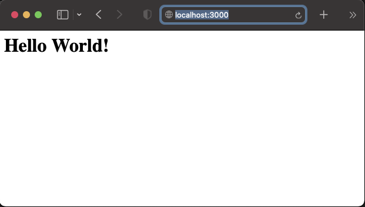

# nodeJS expressJS menampilkan Hello World!

---

buat direktori project

    ❯ mkdir nodejs-expressJS-docker-compose-HelloWorld

instalasi expressjs:

    ❯ npm install express

buat file json secara manual dan isinya.

    ❯ app.js

jalankan aplikasi:

    ❯ node app.js

    op:
        Server berjalan di http://localhost:3000

---

    

Aplikasi pada Browser

---

# container aplikasi dengan Docker-compose 

buat file berikut dan isinya :

    - docker-compose.yml :

        version: '3'

        services:

            expressjs-app:

                container_name: nodejs-app-helloworld

                build:

                    context: .

                    dockerfile: Dockerfile

                image: expressjs-app-helloworld 

                ports:

                - "3000:3000"

                volumes:

                - .:/app

                environment:

                - NODE_ENV=develop

                stdin_open: true

                tty: true

                restart: unless-stopped

    - Dockerfile :

        FROM node:14-alpine

        WORKDIR /app

        COPY package*.json ./

        RUN npm install

        COPY . .

        CMD ["node", "app.js"]

jalankan docker compose:

    ❯ docker-compose up --build -d

docker list:

    ❯ docker images

        REPOSITORY                 TAG       IMAGE ID       CREATED          SIZE

        expressjs-app-helloworld   latest    b94220d2ff90   23 seconds ago   124MB

    ❯ docker ps -a

        CONTAINER ID   IMAGE                      CREATED          STATUS          PORTS                       NAMES

        d383967ab13b   expressjs-app-helloworld   26 seconds ago   Up 25 seconds   0.0.0.0:3000->3000/tcp      nodejs-app-helloworld
